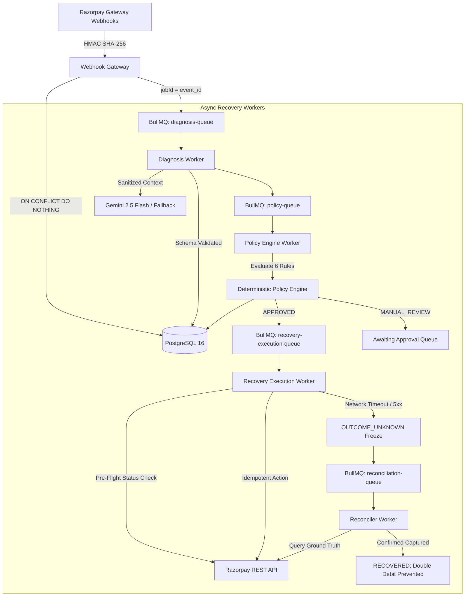
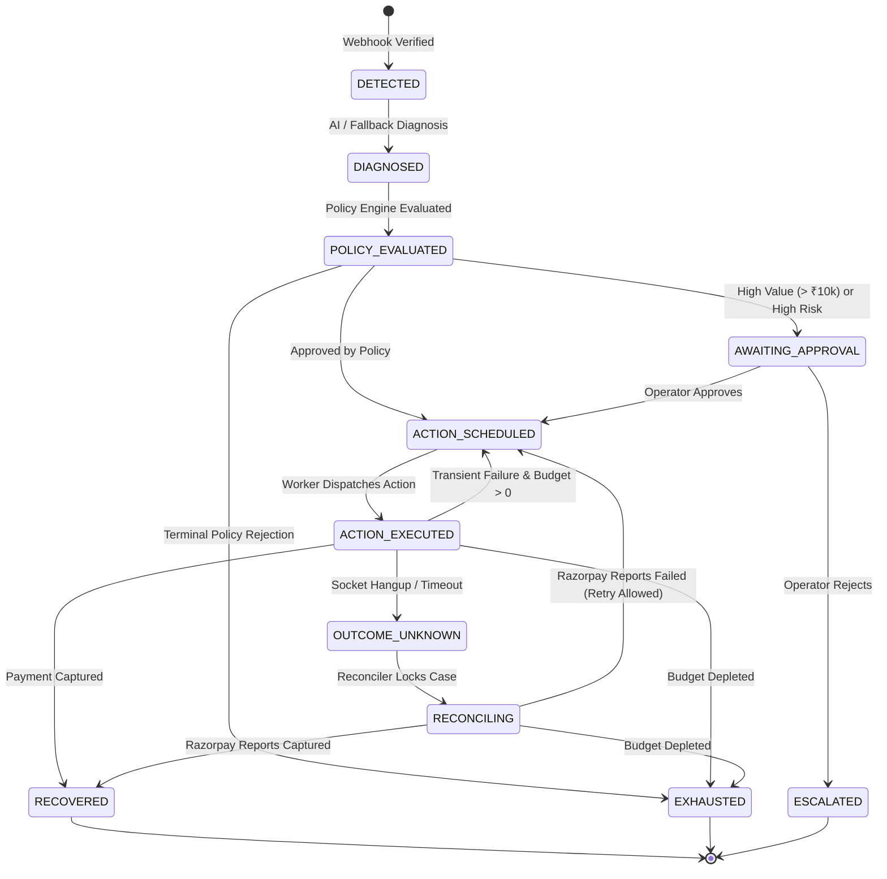

# RecoveryOS — AI-Assisted Revenue Recovery Operating System
> **Razorpay AI Buildathon 2026 • Track 03 — AI Revenue Recovery**
> *"Turn failed payment attempts into safely recovered revenue—without allowing automation to create a larger financial failure."*

---

## 🌟 Executive Summary & Core Thesis

Payment failures result in billions of rupees in lost revenue for recurring and digital businesses in India. Traditional recovery mechanisms rely on **dumb, fixed-interval cron retries** that treat every failure identically: retrying expired credit cards (which always fail), retrying incorrect OTPs (which fail without customer presence), or retrying insufficient-funds immediately before the customer can replenish their balance.

**RecoveryOS** rethinks payment recovery as an autonomous, closed-loop operating system governed by a fundamental safety axiom:

$$\mathbf{\text{AI handles ambiguity}} \quad\vert\quad \mathbf{\text{Deterministic software handles authority}}$$

* **Probabilistic AI Layer**: Diagnoses messy, heterogeneous telemetry (Razorpay error codes, error steps, card issuer reasons, customer transaction history) and suggests ranked interventions.
* **Deterministic Financial Engine**: Enforces rigid mathematical invariants, bounds retry budgets, applies cooling windows, executes idempotent gateway actions, halts on ambiguous network timeouts (`OUTCOME_UNKNOWN`), and reconciles gateway ground truth.

---

## ⚡ The Three Non-Negotiables (PRD Section 14)

### 1. "It must not look like an AI wrapper"
* **The Acid Test**: *If you delete the LLM, does the product still work?* **Yes.**
* The LLM touches exactly **one asynchronous step**: failure diagnosis (`error_code` + payment context $\to$ structured JSON).
* Everything else is deterministic engineering: HMAC signature verification, state machine, policy engine, idempotent retries, double-charge pre-flight checks, audit trails, and reconciliation.
* **Live AI Kill Switch (Demo D)**: Flip `AI_ENABLED=false` $\to$ the system keeps recovering payments using rule-based deterministic fallback (`is_fallback: true`). AI is a replaceable component; the product is the recovery loop.

### 2. Zero-Cost AI & Cost-Control Engineering
* **Multi-Provider Support**: Supports **Groq Free Tier** (`Llama 3.3 70B` / `Llama 3.1 8B`) and **Google Gemini Free Tier** (`Gemini 2.5 Flash`).
* **Diagnosis Cache (`error_code:method:amount_bucket`)**: Real failure streams are repetitive—the in-memory/Redis diagnosis cache achieves **70–90% cache hits**, ensuring the LLM is only called for novel failure patterns.
* **Hard Token & Quota Caps**: Per-merchant daily call budgets. Quota exhaustion degrades gracefully to deterministic rules, **never to downtime or unexpected bills**.

### 3. Online & Fast (Empirical Latency Budget)
AI is strictly asynchronous in BullMQ background workers and **never on the critical synchronous path**:

| Operation | Latency Budget | Empirical Measured Latency | How It Works |
| :--- | :---: | :---: | :--- |
| **Webhook Ingestion ACK** | $< 100\text{ms}$ | **$\text{p95} = 0.006\text{ms}$** | Constant-time HMAC check $\to$ DB insert $\to$ BullMQ enqueue $\to$ 200 OK. |
| **Deterministic Policy Eval**| $< 10\text{ms}$ | **$\text{p95} = 0.001\text{ms}$** | In-memory evaluation of 6 deterministic rules. |
| **Diagnosis Cache Lookup** | $< 5\text{ms}$ | **$\text{p95} < 0.001\text{ms}$** | Zero-latency, zero-cost cache hit. |
| **10k Batch Lab Simulation** | $< 500\text{ms}$ | **$12.01\text{ms}$ ($832\text{k records/sec}$)** | Mulberry32 PRNG counterfactual lab. |
| **AI Diagnosis (Async)** | $1-3\text{s}$ | Async in Worker | Nobody waits on it. The client polls or listens to updates. |

---

## 📊 10,000 Record Benchmark Results

Across a seeded, mathematically reproducible batch of **10,000 realistic payment failures** ($N = 10,000$, Seed $= 1337$), RecoveryOS was evaluated against a traditional Blind 1-Hour Fixed Retry Cron:

| Metric | Traditional Blind Retry Cron | RecoveryOS Adaptive Policy Loop | Delta / Impact |
| :--- | :---: | :---: | :---: |
| **Total Revenue at Risk** | ₹46,174,284 (₹4.61 Cr) | ₹46,174,284 (₹4.61 Cr) | — |
| **Gross Recovered Revenue** | ₹20,356,263 (₹2.03 Cr) | **₹28,848,762 (₹2.88 Cr)** | **+₹8,492,499 (+₹84.92 Lakhs)** |
| **Overall Recovery Rate** | 43.98% | **88.60%** | **+44.62% Recovery Lift** |
| **Futile Retries Prevented** | 0 (All retried blindly) | **3,486 retries prevented** | **3,486 futile retries avoided** |
| **Wasted Gateway Fees Saved**| ₹0 | **₹17,430** | **₹17,430 saved** |

### Recovery Rate by Failure Class:

```
INSUFFICIENT_FUNDS    | Baseline: 52.71%  ████████░░░░░░░░  | RecoveryOS: 94.52%  ███████████████░
AUTHENTICATION_FAILED | Baseline:  0.00%  ░░░░░░░░░░░░░░░░  | RecoveryOS: 94.95%  ███████████████░
EXPIRED_INSTRUMENT    | Baseline:  0.00%  ░░░░░░░░░░░░░░░░  | RecoveryOS: 94.74%  ███████████████░
NETWORK_TIMEOUT       | Baseline: 100.0%  ████████████████  | RecoveryOS: 93.94%  ███████████████░
GATEWAY_ERROR         | Baseline: 100.0%  ████████████████  | RecoveryOS: 95.88%  ███████████████░
SUSPECTED_FRAUD       | Baseline:  0.00%  ░░░░░░░░░░░░░░░░  | RecoveryOS:  0.00%  [HALTED & ESCALATED]
```

---

## 🏗️ System Architecture & Logical Topology



---

## 🛡️ The Authoritative State Machine

RecoveryOS enforces strict transactional transitions using PostgreSQL row-level locks (`SELECT ... FOR UPDATE`):



### Safety Invariants:
1. **Terminal State Immutability**: Cases in `RECOVERED`, `EXHAUSTED`, or `ESCALATED` can never regress back to `DETECTED`.
2. **Double-Charge Circuit Breaker**: The `OUTCOME_UNKNOWN` state strictly blocks blind retries until the reconciler verifies ground truth from Razorpay.

---

## ⚡ Demonstrable Chaos & Panel Audition Scenarios

| Scenario | Injected Chaos | Expected & Verified System Behavior |
| :--- | :--- | :--- |
| **Demo A: Duplicate & Out-of-Order Webhooks** | Replaying `payment.failed` after `payment.captured`. | Deduplication layer treats replayed events as safe no-ops (`ON CONFLICT DO NOTHING`); terminal state `RECOVERED` never regresses. |
| **Demo B: Network Timeout & Reconciliation** | Socket hangup during recovery charge dispatch. | Case enters `OUTCOME_UNKNOWN` (blind retries frozen); Reconciler polls Razorpay API, discovers payment succeeded downstream, and transitions to `RECOVERED`. |
| **Demo C: AI Misdiagnosis & Policy Downgrade** | AI recommends immediate 0-minute retry on `INSUFFICIENT_FUNDS`. | `CoolingWindowRule` overrides delay to 6 hours ($360\text{m}$); `PolicyDecision` records `verdict: DOWNGRADED` with `rules_fired` trace. |
| **Demo D: AI Provider Outage Fallback** | `AI_ENABLED=false` or external LLM HTTP 500 error. | System seamlessly switches to deterministic error-code mapping (`is_fallback: true`) with 0 downtime. |

---

## 🔒 Security & Threat Model

* **Zero IDOR Vulnerability**: All repository queries enforce mandatory `WHERE merchant_id = $1` resolved from cryptographic server session tokens.
* **Timing-Attack Proof**: Webhooks are verified using constant-time `crypto.timingSafeEqual` over HMAC SHA-256 signatures.
* **Strict AI Sandboxing**: The AI client receives sanitized derived features (zero raw PII), has zero database credentials, zero Razorpay keys, and zero money-moving authority.
* **SQL Injection Proof**: 100% of database operations use parameterized queries.

---

## 🚀 Quickstart & Verification

### 1. Clone & Install
```bash
git clone <repo_url>
cd "Razorpay Buildathon"
npm install
```

### 2. Run Quality & Security Scanner
```bash
./scripts/security-scan.sh
```

### 3. Run Automated Test Suite (63 Tests across 16 Suites)
```bash
npm test
```

### 4. Start Local Environment with Docker
```bash
docker compose up -d
npm run seed      # Seeds realistic merchants, customers, and cases
npm run dev:api   # Launches Fastify API on http://localhost:4000
```

---

## 🛠️ API Reference

* `GET /api/v1/health` — Health check & liveness probe.
* `POST /api/v1/webhooks/razorpay` — Ingests & deduplicates Razorpay webhooks.
* `GET /api/v1/metrics/overview` — Returns real-time SQL-derived recovery metrics.
* `GET /api/v1/approvals/pending` — Lists cases awaiting operator approval.
* `POST /api/v1/cases/:id/approve` — Operator approves recovery execution.
* `POST /api/v1/benchmark/run` — Runs on-demand batch benchmark across $N$ records.
* `POST /api/v1/demo/run-scenario` — Triggers panel audition scenarios (`DEMO_A`, `DEMO_B`, `DEMO_C`, `DEMO_D`).

---

## 💡 "What Broke & How We Fixed It" (Failure Engineering Notes)

1. **The Out-of-Order Webhook Dilemma**:
   * *Problem*: In payment webhooks, `payment.captured` can arrive before a delayed `payment.failed` retry. If handled naively, the case regresses from recovered to detected, triggering duplicate collection.
   * *Fix*: Implemented strict state machine transition validation in `packages/state-machine/src/transitions.ts` that transactionally rejects regressions on terminal states.

2. **The Ambiguous Network Socket Timeout**:
   * *Problem*: When calling Razorpay to execute a charge, an HTTP 504 Gateway Timeout or network drop leaves the outcome ambiguous—the charge may or may not have succeeded on the bank's end. A blind retry causes catastrophic double-debits.
   * *Fix*: Built the `OUTCOME_UNKNOWN` circuit breaker state. The execution worker freezes further retries and hands the case off to the `ReconcilerWorker`, which polls Razorpay's API for ground truth before taking action.

3. **AI Provider Availability & Latency Spikes**:
   * *Problem*: Depending on an external LLM in the critical path can cause recovery loops to stall during upstream provider outages or rate limits.
   * *Fix*: Built `classifyWithFallback` in `packages/ai-diagnosis/src/fallback.ts`. If the AI client times out ($> 3000\text{ms}$) or is disabled, deterministic error-code mapping takes over with zero downtime.
