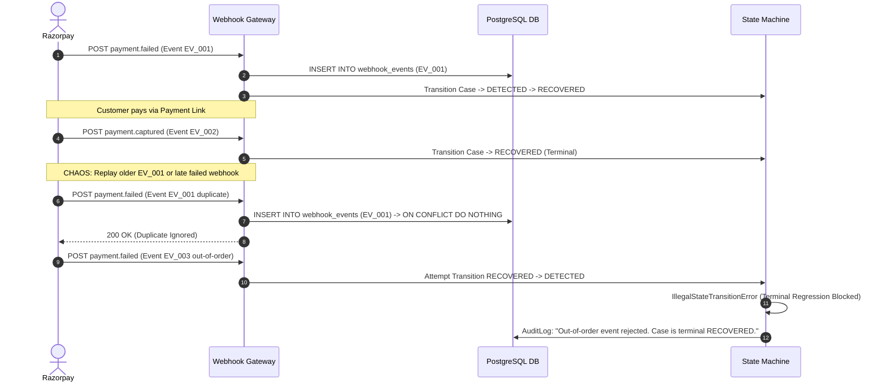
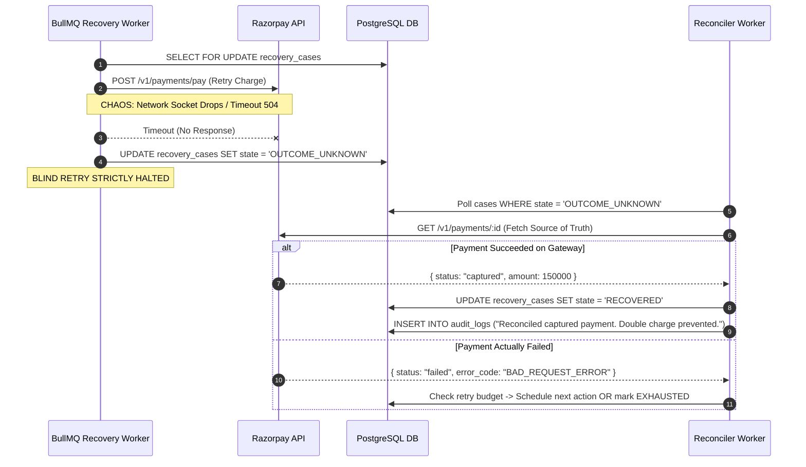

# RecoveryOS — Reliability, Failure Recovery & Chaos Lab Specification

## 1. Overview

In payment systems, failure is normal. RecoveryOS is built from the ground up to survive gateway timeouts, out-of-order webhooks, double deliveries, AI hallucinations, and upstream provider outages.

This document formalizes the **4 Core Failure Scenarios** that serve as the technical audition proofs for the Razorpay panel.

---

## 2. Failure Scenarios

### Demo A: Duplicate & Out-of-Order Webhooks

#### Sequence & Chaos Trigger:
1. Razorpay sends initial webhook: `payment.failed` ($t=0$).
2. Case is created in `DETECTED` $\to$ transitions through `ACTION_SCHEDULED` $\to$ Customer completes payment via alternative link $\to$ Razorpay sends `payment.captured` ($t=10$).
3. Case transitions to terminal `RECOVERED`.
4. **Chaos Injection**: 
   * (a) Webhook delivery service retries the initial `payment.failed` event ($t=15$).
   * (b) Network delayed an older duplicate `payment.failed` event.



#### Assertions & Verification:
* Exactly 1 recovery case created.
* Zero duplicate recovery interventions scheduled.
* `RECOVERED` state never regresses.
* Audit log records duplicate deduplication and illegal state transition rejection.

---

### Demo B: Network Timeout & Double-Charge Prevention (`OUTCOME_UNKNOWN`)

#### Sequence & Chaos Trigger:
1. BullMQ Worker picks up scheduled action (e.g. mandate retry).
2. Worker acquires DB row lock (`SELECT FOR UPDATE`) and sets status to `ACTION_EXECUTED`.
3. Worker sends charge request to Razorpay.
4. **Chaos Injection**: Network drops / HTTP connection hangs for 10 seconds before Razorpay response can be received.
5. System catches socket timeout. **Crucial Rule: Do NOT blindly retry.**
6. Worker transitions case to `OUTCOME_UNKNOWN`.
7. Reconciler worker wakes up, queries Razorpay API directly (`GET /v1/payments/:id`).
8. If Razorpay shows `captured`: mark case `RECOVERED`.
9. If Razorpay shows `failed`: allow next scheduled action if retry budget remains.



#### Assertions & Verification:
* Zero additional charge attempts made during timeout window.
* Gateway truth is fetched before mutating state.
* Double debits are mathematically eliminated.

---

### Demo C: AI Misdiagnosis & Policy Downgrade

#### Sequence & Chaos Trigger:
1. Seed a failure: Card declined due to `INSUFFICIENT_FUNDS`.
2. **Chaos Injection / Mocked AI Output**: The AI hallucinates or recommends an aggressive strategy:
   * Recommended Action: `DELAYED_RETRY`
   * Recommended Delay: `0 minutes` (Immediate retry)
   * Recommended Attempts: `5 retries`
3. Diagnosis is piped to the Deterministic Policy Engine.
4. Policy Engine evaluates `CoolingWindowRule` and `RetryBudgetRule`:
   * Rule 1 detects `recommended_delay_minutes < 360` $\to$ overrides delay to `360 minutes`.
   * Rule 2 detects `recommended_attempts > max_retry_attempts (2)` $\to$ bounds total attempts to `2`.
5. Verdict produced: `DOWNGRADED`.

#### Assertions & Verification:
* The AI's unsafe parameters are constrained.
* The case timeline shows:
  * Raw AI Recommendation: Immediate / 5 retries.
  * Policy Decision: Downgraded to 6h delay / 2 retries.
  * Rules Fired: `[CoolingWindowRule, RetryBudgetRule]`.

---

### Demo D: AI Outage / Fallback Activation

#### Sequence & Chaos Trigger:
1. **Chaos Switch**: Set environment flag `AI_ENABLED=false` or simulate AI HTTP 500 / 3s timeout.
2. New failed payment webhook arrives.
3. Diagnosis worker detects AI is disabled/unresponsive.
4. Worker immediately routes payload to `packages/ai-diagnosis/src/fallback.ts`.
5. Deterministic error code map assigns category:
   * `BAD_REQUEST_ERROR / INSUFFICIENT_FUNDS` $\to$ `INSUFFICIENT_FUNDS` (Confidence 1.0, Action `DELAYED_RETRY`).
   * `GATEWAY_ERROR` $\to$ `NETWORK_TIMEOUT` (Confidence 1.0, Action `DELAYED_RETRY`).
6. State machine marks `is_fallback: true` on `diagnoses` table and proceeds smoothly through policy evaluation.

#### Assertions & Verification:
* Recovery operations never halt due to external LLM downtime.
* System recovery rate and throughput remain stable.

---

## 3. Server-Gated Chaos Lab API Specification

All chaos triggers are protected behind a dedicated server-side endpoint with strict authorization:

```
POST /api/v1/chaos/inject
Headers:
  Authorization: Bearer <ADMIN_SESSION_TOKEN>
  X-Demo-Mode: true

Request Body:
{
  "scenario": "SIMULATE_TIMEOUT" | "REPLAY_DUPLICATE_WEBHOOK" | "SIMULATE_AI_HALLUCINATION" | "TOGGLE_AI_OUTAGE",
  "target_case_id": "UUID",
  "parameters": {
    "timeout_ms": 10000,
    "ai_enabled": false
  }
}
```
