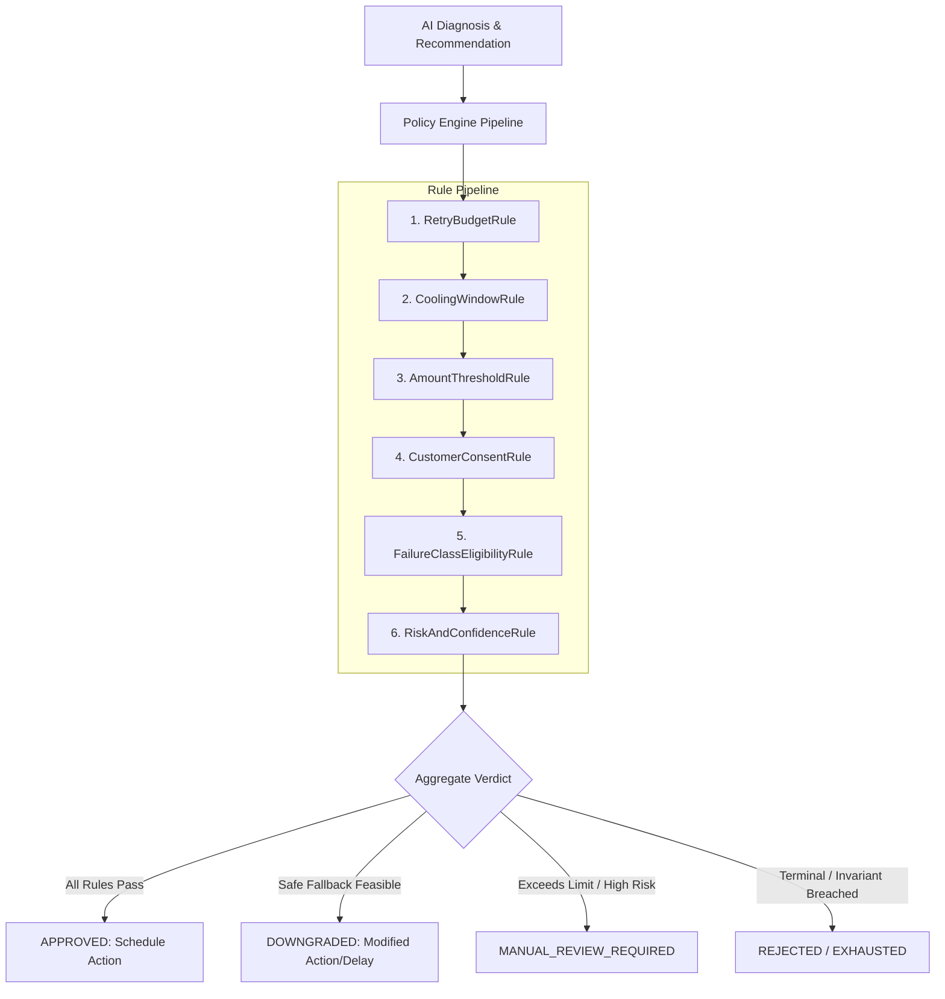

# RecoveryOS — Deterministic Policy Engine Specification

## 1. Core Principles

The Policy Engine is the **financial authority and safety backstop** of RecoveryOS. It operates as a deterministic, pure TypeScript package with zero external network or AI dependencies.

* **Rule 1: AI cannot grant itself execution authority.**
* **Rule 2: Every action must pass ALL mandatory safety rules.**
* **Rule 3: Rule evaluations produce an immutable `rules_fired` trace for auditability.**
* **Rule 4: Any violation downgrades or rejects the action gracefully.**

---

## 2. The 6 Deterministic Policy Rules



---

### Rule 1: `RetryBudgetRule`
* **Objective**: Prevent infinite retry loops and charge penalties from payment networks.
* **Logic**:
  * Check current `attempt_count` of the `RecoveryCase`.
  * If `attempt_count >= merchant_policy.max_retry_attempts`:
    * If action is `DELAYED_RETRY`, downgrade to `PAYMENT_LINK` (if allowed) or `REJECT` $\to$ `EXHAUSTED`.
    * Mark rule as `passed: false, reason: "Maximum retry budget reached (${attempt_count}/${max_retry_attempts})"`.
* **Output**: Blocks further direct gateway retries when budget is exhausted.

---

### Rule 2: `CoolingWindowRule`
* **Objective**: Prevent rapid-fire retries that irritate customers or trigger bank rate limits.
* **Logic**:
  * For `INSUFFICIENT_FUNDS` or temporary card issues, enforce a minimum cooling period (e.g. 6 hours).
  * If the AI recommends a delay less than `merchant_policy.cooling_window_hours * 60`:
    * Override and extend `delay_minutes` to `cooling_window_hours * 60`.
    * Mark verdict as `DOWNGRADED` with rule trace: `"Enforced minimum cooling window of ${cooling_window_hours} hours"`.

---

### Rule 3: `AmountThresholdRule`
* **Objective**: Guardrail high-value monetary recovery actions against automated mistakes.
* **Logic**:
  * Compare `payment.amount_in_paise` with `merchant_policy.max_auto_recovery_amount_paise` (e.g. ₹10,000 / 1,000,000 paise).
  * If `payment.amount > max_auto_recovery_amount_paise`:
    * Set verdict to `MANUAL_REVIEW_REQUIRED`.
    * Route case to `AWAITING_APPROVAL` queue.
    * Mark rule trace: `"Payment amount (₹${amount}) exceeds auto-recovery threshold (₹${limit}). Manual operator approval required."`

---

### Rule 4: `CustomerConsentRule`
* **Objective**: Enforce regulatory compliance and anti-spam constraints (TRAI / DND / WhatsApp policies).
* **Logic**:
  * If action is `CUSTOMER_NOTIFICATION`:
    * Verify that `customer.has_sms_consent == true` (for SMS) or `customer.has_whatsapp_consent == true` (for WhatsApp).
    * If consent is missing, downgrade action to `PAYMENT_LINK` via email only or `NO_ACTION`.
    * Mark rule trace: `"Customer has not provided messaging consent for requested channel."`

---

### Rule 5: `FailureClassEligibilityRule`
* **Objective**: Ensure that the recovery intervention is mathematically and operationally compatible with the failure root cause.
* **Eligibility Matrix**:

| Failure Class | Allowed Actions | Disallowed Actions (Strictly Blocked) |
| :--- | :--- | :--- |
| `INSUFFICIENT_FUNDS` | `DELAYED_RETRY` (with cooling window), `PAYMENT_LINK` | Immediate Retry |
| `NETWORK_TIMEOUT` | Immediate / Short `DELAYED_RETRY`, `RECONCILIATION` | Customer notification |
| `EXPIRED_INSTRUMENT` | `PAYMENT_LINK` (Update Card/UPI), `CUSTOMER_NOTIFICATION` | `DELAYED_RETRY` (Never retry expired card) |
| `AUTHENTICATION_FAILED` | `PAYMENT_LINK` (Requires customer presence for 3DS/OTP) | Auto `DELAYED_RETRY` (Will fail without OTP) |
| `SUSPECTED_FRAUD` | `MANUAL_ESCALATION`, `NO_ACTION` | Any automated retry or link generation |

---

### Rule 6: `RiskAndConfidenceRule`
* **Objective**: Ensure that low-confidence AI predictions do not trigger unverified automated actions.
* **Logic**:
  * Check `diagnosis.confidence`.
  * If `confidence < merchant_policy.min_ai_confidence_threshold` (e.g. $< 0.70$):
    * If fallback action is safe (e.g. gentle payment link via email), downgrade.
    * Otherwise, escalate to `AWAITING_APPROVAL`.
    * Mark rule trace: `"AI confidence (${confidence}) is below required policy threshold (${min_ai_confidence_threshold})."`

---

## 3. Policy Execution Trace Interface

Every evaluation outputs an inspectable JSON structure stored in `policy_decisions.rules_fired`:

```json
{
  "verdict": "DOWNGRADED",
  "action_type": "DELAYED_RETRY",
  "delay_minutes": 360,
  "requires_manual_approval": false,
  "rules_fired": [
    {
      "rule_name": "RetryBudgetRule",
      "passed": true,
      "reason": "Attempt 1 of 2."
    },
    {
      "rule_name": "CoolingWindowRule",
      "passed": false,
      "reason": "AI proposed 10 min delay; policy enforced 360 min cooling window for INSUFFICIENT_FUNDS."
    },
    {
      "rule_name": "AmountThresholdRule",
      "passed": true,
      "reason": "Amount ₹1,499 is below auto-threshold ₹10,000."
    },
    {
      "rule_name": "CustomerConsentRule",
      "passed": true,
      "reason": "Customer has verified notification consent."
    },
    {
      "rule_name": "FailureClassEligibilityRule",
      "passed": true,
      "reason": "DELAYED_RETRY is eligible for INSUFFICIENT_FUNDS."
    },
    {
      "rule_name": "RiskAndConfidenceRule",
      "passed": true,
      "reason": "AI confidence 0.92 >= threshold 0.70."
    }
  ]
}
```
