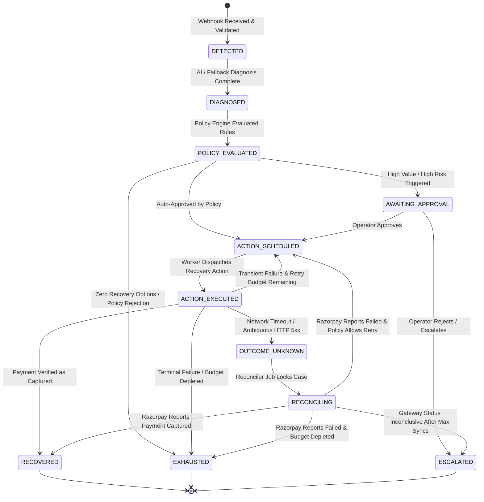

# RecoveryOS — Authoritative State Machine Specification

## 1. Overview & Core Philosophy

In a financial recovery system, payment and case states must be strictly consistent and deterministic. 
The state machine guarantees that:
1. **No race condition can cause double recovery actions.**
2. **Terminal states (`RECOVERED`, `EXHAUSTED`, `ESCALATED`) are immutable and can never regress.**
3. **`OUTCOME_UNKNOWN` is a first-class state that strictly freezes all recovery actions until reconciliation confirms reality.**

---

## 2. State Machine Diagram



---

## 3. State Definitions

| State | Description | Invariant / Precondition |
| :--- | :--- | :--- |
| `DETECTED` | Initial state upon ingestion of a verified `payment.failed` webhook. | Exactly 1 `WebhookEvent` linked. |
| `DIAGNOSED` | AI or deterministic fallback classification has attached failure category & confidence. | Exactly 1 immutable `Diagnosis` record linked. |
| `POLICY_EVALUATED` | The deterministic rules engine has evaluated the diagnosis against merchant policy. | Exactly 1 `PolicyDecision` record linked with `rules_fired`. |
| `AWAITING_APPROVAL` | High-risk or high-value recovery requires manual operator review. | Case is paused; automated dispatch is blocked. |
| `ACTION_SCHEDULED` | A bounded recovery action (retry, payment link, notification) is queued with a delay. | Action payload and idempotency key are generated. |
| `ACTION_EXECUTED` | The recovery action has been dispatched to Razorpay / messaging provider. | `Intervention` record marked with status. |
| `OUTCOME_UNKNOWN` | Network timeout, socket hangup, or ambiguous 5xx received during dispatch. | **BLIND RETRIES BLOCKED.** Dispatches reconciliation job. |
| `RECONCILING` | Active background check polling Razorpay payment status directly via REST API. | Exclusive transactional lock held by Reconciler. |
| `RECOVERED` (Terminal) | Ground truth confirmed payment is `captured` / `paid`. | Revenue credited. No further interventions allowed. |
| `EXHAUSTED` (Terminal) | All retry budgets, cooling windows, or policy rules have been exhausted without success. | Terminal. Case closed. |
| `ESCALATED` (Terminal) | Manual intervention required or irreconcilable gateway status. | Handed off to human ops team. |

---

## 4. Valid Transition Matrix

| From State | Allowed Target States | Trigger / Condition |
| :--- | :--- | :--- |
| `DETECTED` | `DIAGNOSED` | Diagnosis completed (AI structured response or fallback). |
| `DIAGNOSED` | `POLICY_EVALUATED` | Policy engine completes rule evaluations. |
| `POLICY_EVALUATED` | `ACTION_SCHEDULED` | Policy decision is `APPROVED` or `DOWNGRADED`. |
| `POLICY_EVALUATED` | `AWAITING_APPROVAL` | Policy decision is `MANUAL_REVIEW_REQUIRED`. |
| `POLICY_EVALUATED` | `EXHAUSTED` | Policy decision is `REJECTED` (e.g. invalid mandate, fraud suspicion). |
| `AWAITING_APPROVAL` | `ACTION_SCHEDULED` | Operator explicitly approves action via dashboard API. |
| `AWAITING_APPROVAL` | `ESCALATED` | Operator rejects action or routes to manual collection. |
| `ACTION_SCHEDULED` | `ACTION_EXECUTED` | BullMQ worker begins execution of recovery action. |
| `ACTION_EXECUTED` | `RECOVERED` | Payment confirmed captured via immediate response or webhook. |
| `ACTION_EXECUTED` | `ACTION_SCHEDULED` | Action resulted in transient failure and retry budget $> 0$. |
| `ACTION_EXECUTED` | `OUTCOME_UNKNOWN` | HTTP timeout / gateway network failure during dispatch. |
| `ACTION_EXECUTED` | `EXHAUSTED` | Action failed and retry budget is exhausted ($= 0$). |
| `OUTCOME_UNKNOWN` | `RECONCILING` | Reconciler worker acquires lock. |
| `RECONCILING` | `RECOVERED` | Razorpay API returns `status === 'captured'`. |
| `RECONCILING` | `ACTION_SCHEDULED` | Razorpay API returns `status === 'failed'` & retry budget remains. |
| `RECONCILING` | `EXHAUSTED` | Razorpay API returns `status === 'failed'` & budget is exhausted. |
| `RECONCILING` | `ESCALATED` | Razorpay API status unresolved after max reconciliation attempts. |

---

## 5. Explicitly Forbidden / Illegal Transitions

The following transitions will throw an `IllegalStateTransitionError` and abort the database transaction:

1. **Terminal State Regression**:
   * `RECOVERED` $\to$ Any other state (Strictly Forbidden).
   * `EXHAUSTED` $\to$ Any other state.
   * `ESCALATED` $\to$ Any other state.
2. **Bypassing Policy Authority**:
   * `DETECTED` $\to$ `ACTION_SCHEDULED` (Forbidden: Policy evaluation cannot be skipped).
   * `DIAGNOSED` $\to$ `ACTION_SCHEDULED` (Forbidden: Must evaluate policy first).
3. **Bypassing Reconciliation upon Ambiguity**:
   * `OUTCOME_UNKNOWN` $\to$ `ACTION_SCHEDULED` (Strictly Forbidden: Retrying an unknown outcome causes double-debits).
   * `OUTCOME_UNKNOWN` $\to$ `ACTION_EXECUTED` (Strictly Forbidden).

---

## 6. Concurrency & Transactional Row-Locking

To prevent race conditions between incoming webhooks and concurrent BullMQ queue workers:

```sql
-- Pattern for claiming and transitioning a RecoveryCase
BEGIN;

SELECT * FROM recovery_cases 
WHERE id = :case_id 
FOR UPDATE;

-- Application checks if current_state matches expected from_state
-- If valid, update state and persist audit log:
UPDATE recovery_cases 
SET state = :to_state, updated_at = NOW() 
WHERE id = :case_id;

INSERT INTO audit_logs (id, case_id, actor, action, from_state, to_state, created_at)
VALUES (:log_id, :case_id, :actor, :action, :from_state, :to_state, NOW());

COMMIT;
```
